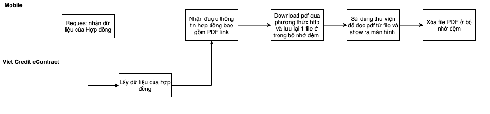

# demo-viet-credit
## flow chart

## flutter pdf library
[PDF library](https://pub.dev/packages/flutter_pdfview)
## flutter code

### Flutter code for download file to a specific path
 Future<File> createFileOfPdfUrl() async {
    final Completer<File> completer = Completer();

    try {
      final url = pdfViewerLink
      final String filename = 'demo.pdf';
      final request = await HttpClient().getUrl(Uri.parse(url));
      final response = await request.close();
      final bytes = await consolidateHttpClientResponseBytes(response);
      final dir = await getApplicationDocumentsDirectory();
      final File file = File('${dir.path}/$filename');

      await file.writeAsBytes(bytes, flush: true);
      completer.complete(file);
    } catch (e) {
      throw Exception('Error parsing asset file!');
    }

    return completer.future;
  }
 ### Reading PDF from assets
  
  FutureBuilder<String>(
  
    Future<String> getPDFLink() async {
    final SharedPreferences prefs = await SharedPreferences.getInstance();

      await createFileOfPdfUrl().then((f) {
        remotePDFpath = f.path;
      });

      return 'done';
    }
    future: controller.getPDFLink(),
    builder:
        (BuildContext context, AsyncSnapshot<String> snapshot) {
      switch (snapshot.connectionState) {
        case ConnectionState.waiting:
          return Text('Loading....');
        default:
          if (snapshot.hasError) {
            return Text('Error: ${snapshot.error}');
          } else {
            return Obx(
              () => PDFView(
                filePath: controller.remotePDFpath,
                swipeHorizontal: true,
              ),
            );
          }
      }
    },
  ),
